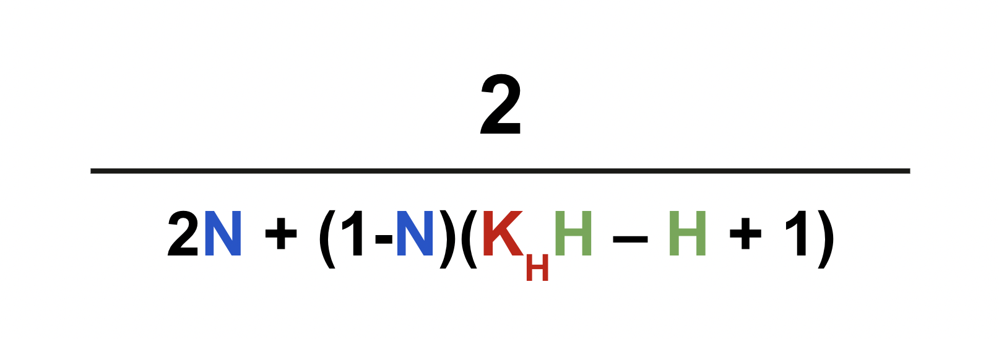

# Дополнительные материалы к докладу "Полсотни приложений одной командой в два раза быстрее"

## Расчет коэффициента флаттера

**Коэффициент флаттера** — коэффициент экономии ресурсов при разработке флаттер-приложения относительно разработки двух нативных приложений (android + ios). Экономия ресурсов измеряется в количестве контрибьютов разработчиков (пуллреквестов).

Коэффициент рассчитывается на основе трех параметров:

1. Процент контрибьютов в натив во флаттер приложении

2. Процент сложных Dart/Flutter-специфичных задач

3. Коэффициент сложности Dart/Flutter-специфичных задач

### Процент контрибьютов в натив

1. [Создать дефолтный dart-пакет](https://dart.dev/guides/libraries/create-library-packages "https://dart.dev/guides/libraries/create-library-packages")

2. Подключить библиотеку [cli_script](https://pub.dev/packages/cli_script "https://pub.dev/packages/cli_script") в pubspec.yaml

3. Скопировать [скрипт](https://gist.github.com/kltsv/be5b8e09f907a722b0e4de3c7c96e8a6 "https://gist.github.com/kltsv/be5b8e09f907a722b0e4de3c7c96e8a6") в проект

4. Перейти в директорию проекта, для которого нужно посчитать контрибьюты в натив

5. Выполнить скрипт из директории проекта `dart [путь_до_скрипт]/contribution_calculator.dart`. Скрипт может работать довольно долго (зависит от количества веток в ремоуте), поэтому для предварительной проверки можно передать в скрипт параметр-число — на каком количестве веток проверить ([подробнее в комментарии](https://gist.github.com/kltsv/be5b8e09f907a722b0e4de3c7c96e8a6#file-contribution_calculator-dart-L4 "https://gist.github.com/kltsv/be5b8e09f907a722b0e4de3c7c96e8a6#file-contribution_calculator-dart-L4")).

6. Дождаться выполнения. В результате получаем json с разбиением по контрибьютерам и их детализацию по контрибьютам (android / ios / both / total).

7. Дальше эти данные можно перенести в любой удобный инструмент аналитики для подсчета, я использовал Google Sheets.

8. Находим общую сумму android+ios+both по всем людям и делим на общую сумму total. **Получаем процент нативных контрибьютов от общего числа контрибьютов (N)**.

### Процент сложных Dart/Flutter задач и коэффициент их сложности

Предварительное требование: в вашем проекте должно трекаться затраченное на задачи время, без этого будет сложно измеримо посчитать. При этом единицы измерения не важны — это могут быть часы или стори поинты, — для конечных результатов это не важно.

Для всех расчетов я использовал Google Sheets.

1. Выгрузить все задачи (вообще все или только за конкретный период) вместе с затраченным на них временем.

2. Посчитать медиану затраченного времени. Используем именно медиану, потому что могут существовать задачи с резкими "выбросами" по затраченному времени, что может сильно аффектить ожидаемый результат.

3. Дальше среди задач ищем все задачи, которые пришлось делать только потому что мы используем Dart и/или Flutter. Это задачи, которые связаны с:  а) интеграцией натива во флаттер; б) багами, несовершенством и неоптимизированностью dart/flutter-библиотек; в) багами, несовершенством и неоптимизированностью самого дарта; г) проблемы с dart/flutter-зависимостями (dependency hell) д) поддержка breaking changes при обновлении языка и фреймворка; е) большим количеством кодогенерации.

4. Количество полученных задач делим на количество всех задач. **Получаем процент сложных задач (H)**.

5. Для тех же задач находим среднее значение затраченного времени. Используем среднее, потому что теперь мы уже отфильтровали задачи, и "выбросы" по времени могут сигнализировать о большой сложности такой задачи — мы хотим это учитывать.

6. Делим полученное среднее на медиану (из пункта 2) — **получаем коэффициент сложных задач (Kh)**.

**Процент общего кода на дарте (бонус)**

1. Объем директории lib: `du -sh lib`.

2. Объем кодгена (на примере freezed): `find . -name "*.freezed.dart" -type f -exec du -ch {} + | grep total`. Так же можно исключить файлы `*.g.dart` и другие, если есть.

3. Отнять от значения из пункта 1 значение из пункта 2.

### Итоговый расчет

Подставляем полученные значения (N, H и Kh) в формулу:

